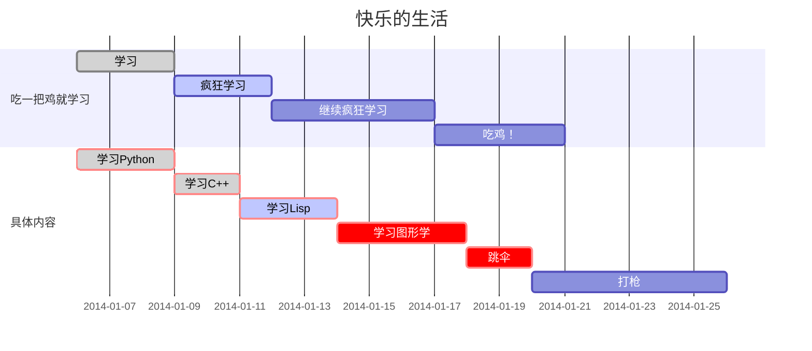

# Markdown语法

## Checkbox

任务列表是带有标记为 [ ] 或 `[x]` 的项目的列表。例如:

```
- [ ] a task list item
- [ ] list syntax required
- [ ] normal **formatting**, @mentions, #1234 refs
- [ ] incomplete
- [x] completed
```

## Table


```
| First Header | Second Header    |
| ------------ | ---------------- |
| Content Cell | Content Cell     |
| Content Cell | **Content Cell** |
```

还可以在表格中包含内联 Markdown,例如链接、粗体、斜体或删除线。

通过`:`在标题行中包含冒号 ( ),可以将该列中的文本设置为左对齐、右对齐或居中对齐:

```
| Left-Aligned  | Center Aligned  | Right Aligned |
| :------------ |:---------------:| -----:|
| col 3 is      | some wordy text | $1600 |
| col 2 is      | centered        |   $12 |
| zebra stripes | are neat        |    $1 |
```

## Blockquote

Markdown 使用电子邮件样式 > 字符来进行块引用。它们呈现为:

```
> This is a blockquote with two paragraphs. This is first paragraph.
>
> This is second paragraph. Vestibulum enim wisi, viverra nec, fringilla in, laoreet vitae, risus.

> This is another blockquote with one paragraph. There is three empty line to separate two blockquotes.
```

## 上标下标

- 水分子: H₂O  --> H<sub>2</sub>O
- 勾股定理: a²+b²=c² --> a<sup>2</sup> + b<sup>2</sup> = c<sup>2</sup>
- a^2

注: 上下的数字可以通过Mac自带的表情与符号输出

## 横线

```
***
---
```

## Internal link

文档内部连接,只能跳转到标题

Hold down Cmd (on Windows: Ctrl) 
click on [this link](#block-elements) to jump to header `Block Elements`. 

```
like [this](#Internal link)
```

## Inline link

This is [an example](http://example.com/ "Title") inline link.

[This link](http://example.net/) has no title attribute.


## Reference Links

一般把 id 放到文章末尾, 避免了内容书写过长的尴尬

This is [an example][id] reference-style link.

Then, anywhere in the document, you define your link label on a line by itself like this:

[id]: http://example.com/  "Optional Title Here"

```
[id]: http://example.com/    "Optional Title Here"
```

## Picture

图片设置

```


```

## footnotes

一般把脚注`[^内容]`放到文章末尾

You can create footnotes like this[^fn1] and this[^fn2].

[^fn1]: Here is the *text* of the first **footnote**.
[^fn2]: Here is the *text* of the second **footnote**.

## 流程图
```
st=>start: Start:>http://www.google.com[blank] 
e=>end:>http://www.google.com 
op1=>operation: My Operation 
sub1=>subroutine: My Subroutine 
cond=>condition: Yes or No?:>http://www.google.com
io=>inputoutput: catch something...
para=>parallel: parallel tasks 
st->op1->cond 
cond(yes)->io->e 
cond(no)->para 
para(path1, bottom)->sub1(right)->op1 
para(path2, top)->op1
```

```flow
st=>start: Start:>http://www.google.com[blank] 
e=>end:>http://www.google.com 
op1=>operation: My Operation 
sub1=>subroutine: My Subroutine 
cond=>condition: Yes or No?:>http://www.google.com
io=>inputoutput: catch something...
para=>parallel: parallel tasks 
st->op1->cond 
cond(yes)->io->e 
cond(no)->para 
para(path1, bottom)->sub1(right)->op1 
para(path2, top)->op1

```

## mermaid图

```
gantt
        dateFormat  YYYY-MM-DD
        title 快乐的生活
        section 吃一把鸡就学习
        学习:done,des1, 2014-01-06,2014-01-09
        疯狂学习:active,des2, 2014-01-09, 3d
        继续疯狂学习:des3, after des2, 5d
        吃鸡！:des4, after des3, 4d
        section 具体内容
        学习Python: crit, done, 2014-01-06,72h
        学习C++: crit, done, after des1, 2d
        学习Lisp: crit, active, 3d
        学习图形学: crit, 4d
        跳伞: crit,2d
        打枪: 6d
```




## 序列图

````
```sequence
Title: Here is a title 
A->B: Normal line 
B-->C: Dashed line 
C->>D: Open arrow 
D-->>A: Dashed open arrow
```
````

```sequence
Title: Here is a title 
A->B: Normal line 
B-->C: Dashed line 
C->>D: Open arrow 
D-->>A: Dashed open arrow
```

## 参考

[Block Elements](https://support.typora.io/Markdown-Reference/#block-elements)

## 问题

### URL中带有特殊符号

URL中带有特殊符号,例如 `( `  、`)`、`‘` 、 `$`等,将他们用16进制ASCII码表示即可

| ASCII | 符号 | ASCII | 符号 |
| ----- | ---- | ----- | ---- |
| 0x28  | (    | 0x3A  | :    |
| 0x29  | )    | 0x3D  | =    |
| 0x27  | '    | 0x2F  | /    |
| 0x2F  | /    | 0x3F  | ?    |

例如:  `www.example.com/a((x=4))sasd`中存在连续两个`)`会导致无法使用链接

将其变为 `www.example.com/a%28%28x=4%29%29sasd`以便正常使用

```
www.example.com/a((x=4))sasd

www.example.com/a%28%28x=4%29%29sasd
```

使用 `%28` 代替 `(`, 使用 `%29` 代替 `)`

其他自负可以参考 [ASCII](./ASCII.md)